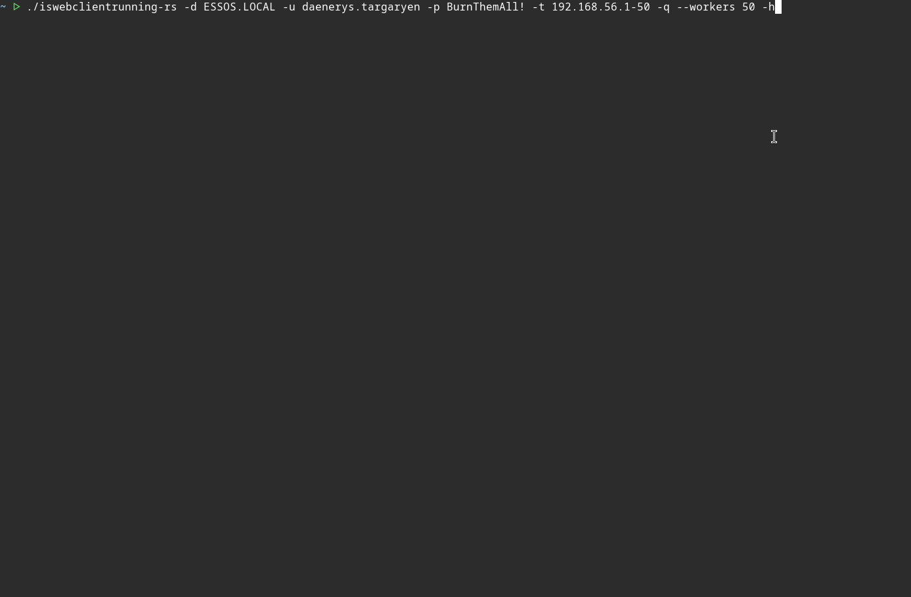

<p align="center">
    <b>IsWebClientRunning-rs</b>
</p>

<p align="center">
    
    
    
    
    
    
    <a href="https://github.com/g0h4n/RustHound-CE/issues/72"></a>
</p>

<hr />

**IsWebClientRunning-rs** probes Windows hosts for a running **WebClient (WebDAV) service** and turns the result into BloodHound-shaped `Computer` data: the `IsWebClientRunning` property. For each target it mounts `IPC$` and opens the named pipe `\PIPE\DAV RPC SERVICE`; a host that answers is running WebClient and is therefore a candidate for **authentication coercion to HTTP** and, from there, **ESC8** (AD CS web-enrollment) NTLM relaying.

It is the probe equivalent of [Hackndo's `webclientservicescanner`](https://github.com/Hackndo/WebclientServiceScanner) and NetExec's `webdav` check, rewritten in pure Rust so it can move into the [RustHound-CE](https://github.com/g0h4n/RustHound-CE) collection as the `Computer`:`IsWebClientRunning` field SharpHound fills. It is built on [icedracon](https://github.com/icedracon)'s `smb2-client` stack, the same one behind [LocalGroups-rs](https://github.com/g0h4n/LocalGroups-rs) and [HasSession-rs](https://github.com/g0h4n/HasSession-rs), and its `src/transport/` folder is copied unchanged from RustHound-CE so the eventual port is a move rather than a rewrite.

- [HELP.md](HELP.md) - How to compile it? How to use it? All options with examples.
- [CHANGELOG.md](CHANGELOG.md) - A record of all significant version changes.
- [ROADMAP.md](ROADMAP.md) - Implemented collection and planned evolutions.

# Quick usage

## Compilation

```bash
# Build a release binary
cargo build --release
# Binary: ./target/release/iswebclientrunning-rs
```

## Installation

```bash
# Install and/or update iswebclientrunning-rs from the cargo command
cargo install --path .
```

## Demo

<p align="center">
    <picture>
        
    </picture>
</p>

## Usage

```bash
# One host, password bind
./iswebclientrunning-rs -d ESSOS.LOCAL -u daenerys.targaryen -p 'BurnThemAll!' -t MEEREEN.ESSOS.LOCAL

# A whole subnet, pass-the-hash, only the hosts that answer
./iswebclientrunning-rs -d ESSOS.LOCAL -u daenerys.targaryen -H :34534854d33b398b66684072224bb47a \
            -t 10.0.0.0/24 --running-only

# Kerberos pass-the-ticket from a ccache, FQDN targets from a file
export KRB5CCNAME=/tmp/daenerys.targaryen.ccache
./iswebclientrunning-rs -d ESSOS.LOCAL -u daenerys.targaryen -k -T hosts.txt

# Low-and-slow sweep, JSON to a loot directory
./iswebclientrunning-rs -d ESSOS.LOCAL -u daenerys.targaryen -p 'BurnThemAll!' \
            -t 10.0.0.0/22 --opsec -o /tmp/loot
```

Three authentication paths are supported, exactly as in RustHound-CE: **NTLMv2 bind** (`-p`), **pass-the-hash** (`-H`), and **Kerberos pass-the-ticket** (`-k`, TGT read from `KRB5CCNAME`). More examples and the full option list are on the [help page](HELP.md).

## Credential safety

Before the sweep, the provided credentials are tested once against a domain controller, so a typo in the domain, username, password or hash fails immediately instead of replaying a bad credential at every target and burning the account's lockout counter. The check does a single SMB `SESSION_SETUP`; a wrong credential aborts the run, an unreachable DC only warns. Point it with `--dc`, or skip it with `--no-validation`.

# Collection

Everything is read-only: the probe performs a `TREE_CONNECT` to `IPC$` and a single `CREATE` on the pipe. No RPC is bound and no bytes are written. The pipe's presence is the whole signal.

| NTSTATUS on `CREATE \PIPE\DAV RPC SERVICE` | Verdict | `IsWebClientRunning` |
|---|---|---|
| `STATUS_SUCCESS` | WebClient **running** | `true` |
| `STATUS_OBJECT_NAME_NOT_FOUND` | service stopped | `false` |
| `STATUS_ACCESS_DENIED` | refused (hardened host) | `Collected: false` |

A running WebClient means the host can be coerced (PetitPotam / PrinterBug / `Coerce*` family) to authenticate to an attacker-controlled HTTP endpoint, which is the first half of an [ESC8](https://posts.specterops.io/certified-pre-owned-d95910965cd2) relay to AD CS web enrollment.

# Output

`computers[]` is serialized in the shape RustHound-CE's `Computer` object expects, so the port is a straight field map. `running` and `running_count` are the operator-facing view, the subset of hosts worth coercing:

```json
{
  "domain": "ESSOS.LOCAL",
  "pipe": "\\PIPE\\DAV RPC SERVICE",
  "hosts_scanned": ["MEEREEN.ESSOS.LOCAL", "BRAAVOS.ESSOS.LOCAL"],
  "running_count": 1,
  "running": ["MEEREEN.ESSOS.LOCAL"],
  "computers": [
    {
      "host": "MEEREEN.ESSOS.LOCAL",
      "address": "10.0.0.10",
      "IsWebClientRunning": true,
      "Collected": true,
      "FailureReason": null,
      "status": "STATUS_SUCCESS"
    }
  ]
}
```

The default output is a colored table; `--json` / `--compact` switch to JSON, `-o <dir>` writes `<datetime>_<domain>_iswebclientrunning.json` next to RustHound-CE's own loot. `--status` and `--running-only` are terse, pipe-friendly stdout modes for feeding coercion tooling.

# Credits

Built on [icedracon](https://github.com/icedracon)'s pure-Rust [`smb2-client`](https://github.com/icedracon/smb2-client). The Kerberos and GSS helpers in `src/transport/` are RustHound-CE's, themselves ported from [adhammer](https://github.com/icedracon/adhammer); the ccache is parsed in-crate and the AP-REQ built with [`picky-krb`](https://github.com/Devolutions/picky-rs), so there is no system GSSAPI dependency. The detection itself follows [Hackndo's `webclientservicescanner`](https://github.com/Hackndo/WebclientServiceScanner) and the WebClient-coercion research by [Elad Shamir](https://posts.specterops.io/) and the SpecterOps ESC8 write-up.

Authorized use only. This tool is for engagements you have written permission to perform.
